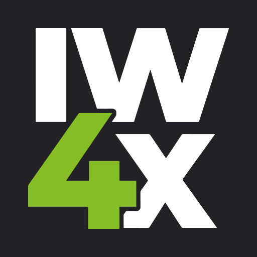

# Aurora IW4x

This fork of IW4x is maintained <i>by Aurora</i> to give better modding capatibilties to IW4 and be unrestricted from the main repository. This fork is always pulling in upstream updates, meaning you can enjoy the new features added here with the latest features from IW4x!

To learn more about IW4x itself, [check the original IW4x repository out.](https://github.com/iw4x/iw4x-client) <b>This includes compiling the Source, which they have a guide on.<>

## New features with Aurora

- Re-added `reloadmenus` command (it is technically unstable, but is made accessible to modders for convinence of menu modding)
- Check if zone exists before running `loadzone`
- Add `take` command
- Add `give ammo` command, which fills up all weapons

## Disclaimer

This software has been created purely for the purposes of
academic research. It is not intended to be used to attack
other systems. Project maintainers are not responsible or
liable for misuse of the software. Use responsibly.
